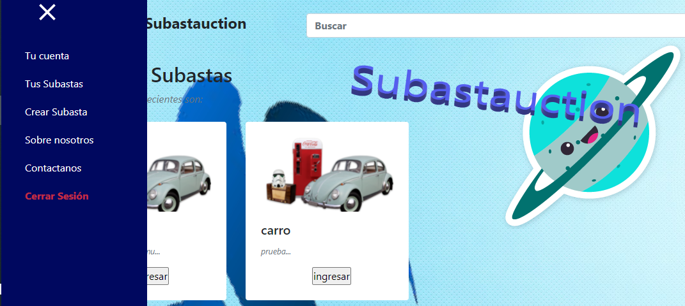

# subastauction

## Proyecto Final: Arquitectura de Software 2021-1

## Integrantes

*  James Alexander Torres Segura.
*  Vanegas Trujillo Janer Stiven.
*  Varon Rojas Daniel Alejandro.

## Despliegue en Heroku ☁️:

## Despliegue en CircleCi✔️:

## Despliegue en Codacy:

## Manual de Usuario:

### Acceso al sitio Web

**Requerimiento:**

* Acceso de Internet.

**Ingrese al navegador y escriba en la barra de direcciones lo siguiente:**

* https://subastauction.herokuapp.com/

**Se mostrará a continuación la interfaz de usuario del login.**

----------

### Inicio de Sesión

Para iniciar sesión se requiere llenar los espacios correspondientes: Correo, Contraseña. Luego hacer clic en el botón Ingresar.

----------

### Registro

En la página de Inicio de sesión, realice clic sobre el botón de **Registrar** que se encuentra debajo del boton de ingresar.

Se procede a realizar el registo y el llenado de los datos necesarios para registrarse como lo son: usuario, correo, numero de telefono, fecha de nacimiento y contraseña, despues se dara clic en el boton registrar para registrar el usuario.

Se dara volver para ingresar al pagina de Inicio de sesión.

----------

### Recuperar Contraseña

En la página de Inicio de sesión, realice clic sobre el botón de **Olvido su contraseña?** que se encuentra encima del boton de ingresar.

Se procede a digitar el correo electronico del usuario y dar clic en el boton de correo de verificación.

Si revisas tu correo encontraras un mensaje de Subastauction con la contraseña.

----------

### Pagina principal.

**Se mostrará a continuación la interfaz de usuario del menú principal de Subastauction.**

En esta interfaz encontraremos las subastas recientes y disponibles, como tambien un menu con los servicios basicos de: tu cuenta, tus subastas, crear subastas, sobre nosotros, contactanos y cerrar sesión.

----------

### Realizar Oferta 

En el menu principal encontraremos las subastas activas procedemos a ingresar a una, allí encontraremos informacion de la subasta, la tbla de la subasta y tendremos la oportunidad de Ofertar por el producto.

----------

### Tu cuenta 

En el menu principal en el menu desplegable encontramos el apartado de Tu cuenta el cual nos permitira Revisar la información disponible de nuestro perfil.

----------

### Mis subastas

En el menu principal en el menu desplegable encontramos el apartado de Mis Subastas el cual nos permitira Revisar las ofertas que tenemos creadas y disponibles.

----------

### Crear subasta

En el menu principal en el menu desplegable encontramos el apartado de Crear Subasta el cual nos permitira crear la subasta, en donde tendremos datos para llenar como: el nombre del articulo a subastar, la descripción del articulo fecha de inicio y fin de la subasta y su oferta inicial.

Una vez lleno los datos se procedera a crear la subasta dando clic una sola vez en crear y click en volver para ver reflejada nuestra subasta en la pagina principal

----------

### Sobre nosotros

En el menu principal en el menu desplegable encontramos el apartado de Sobre nosotros con una breve descripción de nuestra marca.

----------

### Contáctenos

En el menu principal en el menu desplegable encontramos el apartado de Contáctenos el cual nos permitira encontrar servicios como: Lineas telefonicas, Facebook, Instagram, y E-mail.

En el apartado de E-mail encontraremos un formulario donde redactaremos nuestros problemas y sera enviando a nuestro correo.

----------

## Trello

### SPRINT 1

Durante el desarrollo de este Sprint se definio lo siguiente:

* Estimaciones de carga.
* Historias de usuario.
* Diagrama de casos de uso.
* Diagrama de componentes.

Puede obtener mas informacion de los anteriores puntos en la Wiki de este repositorio.

### SPRINT 2 

Durante el desarrollo de este sprint se lograron las siguientes funcionalidades:

* Registro y login de usuario.
* Creación de eventos de subastas.
* Vista principal de eventos.

### SPRINT 3

Durante el se desarrollo de este Sprint se logro lo siguiente:

* Correciones de funcionalidades en el Sprint 2.
* Vista perfil de usuario.
* Vista subastas de usuario.
* Vistas contacto, soporte.
* Implementacion de cache
* Implementacion web socket

